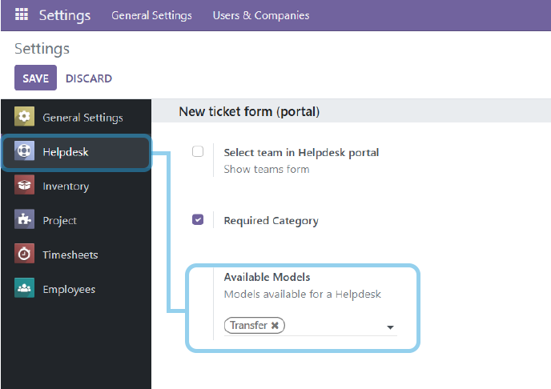
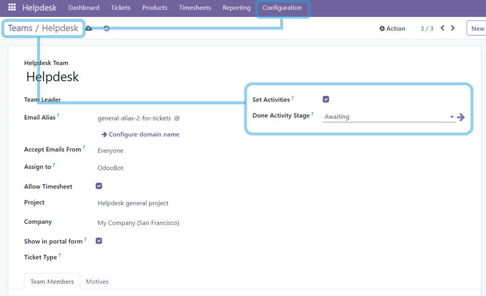

## **To Configure Available Odoo Models**

- Go to Helpdesk--\>Configuration--\>Settings
- In the Available Models field add models available for a Helpdesk

## To Configure Ticket's Stage on Activity State\*\*

- Go to Helpdesk--\>Configuration--\>Teams
- Create a new team or select an existing record
- Enable the "Set Activities" checkbox to enable the feature
- Select the "Done Activity Stage" to move the ticket when the activity
  is done

