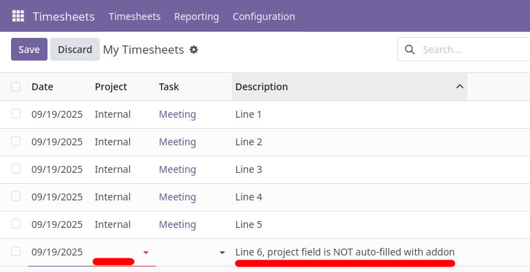

The feature provided by this module is enabled automatically after installation, with no further steps required.

By default, when adding a new line in a timesheet, the system will autofill the Project field if the same project was selected in the last five entries, as shown below:

With this module installed, this behaviour is disabled and the Project field must be selected manually each time, regardless of previous selections, as shown below:

