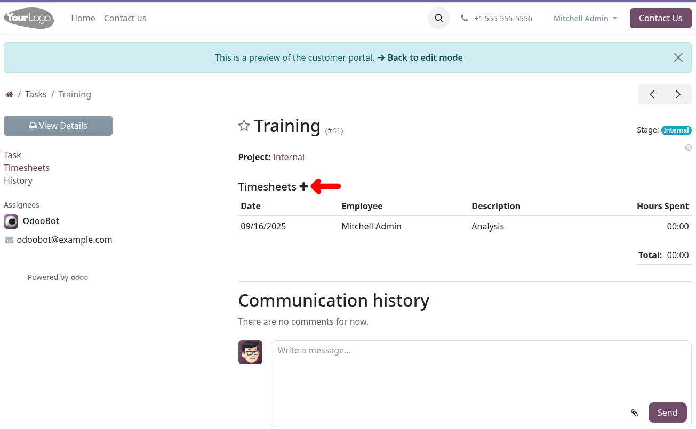
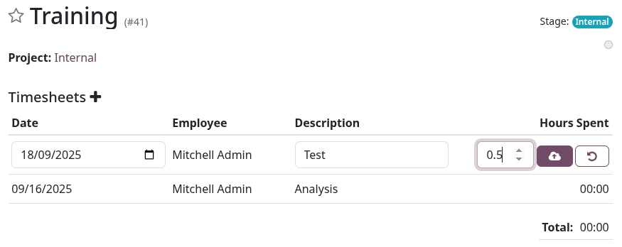

Users in the Website group Editable timesheets will see a plus button when they hover over Timesheets.

Clicking the plus button allows them to add a new timesheet line:

They can also edit their timesheet lines by hovering over a line and clicking the pencil button next to the date, or delete a line by clicking the cross next to the duration:

